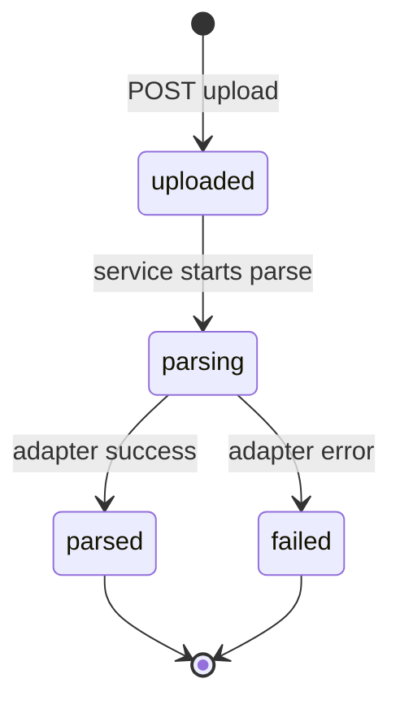

# Contract: document persistence

**Version:** `v001`  
**Code:** `backend/src/shared/contracts/documentPersistence.contract.js`  
**Path resolver:** `backend/src/shared/storage/resolveDocumentStoragePaths.js`  
**Implementation guide:** [templates/document-persistence/README.md](../templates/document-persistence/README.md)

## Purpose

Runtime storage for **user uploads** and **parsed domain models** — separate from [file exchange](./fileExchange.contract.md).

| Concern | This contract | File exchange |
|---------|---------------|---------------|
| Audience | Application users / API clients | Humans and agents triaging bundles |
| Inbound | `POST /api/<module>/upload` (multipart) | `npm run import:file-exchange` |
| Raw files | `data/uploads/{documentId}/` | `file-exchange/imports/{stamp}/` |
| Parsed output | Database rows | Session folders under `exports/` |
| Query | SQL via repositories | Folder listing / JSON files |

**Do not** route production uploads through `file-exchange/imports`. File exchange remains optional for offline agent handoff only.

## Storage split (two tiers)

```text
Tier 1 — Blob storage (filesystem)
  data/uploads/{documentId}/
    original.{ext}              ← immutable upload bytes
    metadata.json               ← optional sidecar (checksum, mime, size)

Tier 2 — Database (Postgres or SQLite)
  documents                     ← upload metadata + parse status
  document_text_versions        ← parsed text / structured JSON
  cases                         ← CaseModel (optional, when case is known)
  case_state_snapshots          ← CaseStateSnapshotModel (optional)
  tasks                         ← TaskModel (optional)
```

Domain shapes align with `backend/src/shared/domain/case-filing/core-models.js`.

## Path resolution

Paths resolve via `resolveDocumentStoragePaths(repoRoot)`:

| Key | In-repo default | Env override |
|-----|-----------------|--------------|
| `uploads` | `{repoRoot}/data/uploads` | `UPLOADS_ROOT` |

When `local-artifacts.json` sets `artifactRoot`, uploads may live at `{artifactRoot}/uploads` (layout key `uploads`).

Precedence: `UPLOADS_ROOT` env > `local-artifacts.json` layout > in-repo default.

## Document lifecycle



| Status | Meaning |
|--------|---------|
| `uploaded` | Bytes on disk; DB row created |
| `parsing` | Parser adapter running |
| `parsed` | At least one `document_text_versions` row |
| `failed` | Parse error recorded on document row |

## Event bus (in-process)

Emit after persistence succeeds (subscribe in other modules; do not import across modules):

| Event | Payload (minimum) |
|-------|-------------------|
| `document.uploaded` | `{ documentId, storagePath, mimeType }` |
| `document.parsed` | `{ documentId, versionId, versionType }` |
| `document.parse_failed` | `{ documentId, error }` |

## Async operations (BullMQ)

Long-running parse work must **not** block the HTTP upload response. After SQL commit:

1. Enqueue `documents.parse` via [asyncJobQueue](./asyncJobQueue.contract.md) (BullMQ + Redis).
2. Worker parses → updates SQL → emits `document.parsed`.

**SQL holds durable state; Redis holds pending jobs only.**

## HTTP surface (implement in owning module)

Implement under `/api/<module-name>/` (e.g. `documents`). Register in `docs/API.md`.

| Method | Path | Purpose |
|--------|------|---------|
| POST | `/upload` | Multipart upload → disk + `documents` row |
| GET | `/documents/:documentId` | Metadata + latest text version |
| GET | `/documents/:documentId/versions` | All text versions |
| POST | `/documents/:documentId/parse` | Trigger parse (idempotent) |

Exact paths are owned by the feature module; table and event names in this contract are stable.

## Module layers (when implemented)

Follow [MODULE_INTERNAL_CONTRACT.md](../MODULE_INTERNAL_CONTRACT.md):

| Layer | Responsibility |
|-------|----------------|
| **routes** | Multer upload, status codes, call services |
| **services** | Upload → parse orchestration, emit events |
| **repositories** | Only layer that runs SQL |
| **adapters/file-storage** | Write/read bytes under `uploads/` |
| **adapters/parser** | OCR / LLM / pdf-parse — returns text + structured JSON |

Copy templates from [templates/document-persistence/](../templates/document-persistence/README.md).

## Database

- Connection: `DATABASE_URL` in `backend/.env` (not wired in starter).
- Migrations: per-module `repositories/migrations/` (copy from contract SQL template).
- Repositories must not leak SQL shapes into routes.

## Implementation checklist

1. Copy templates from `docs/architecture/templates/document-persistence/`.
2. `npm run new:module -- documents --label "Documents"` (or your module name).
3. Add `DATABASE_URL`; run migration SQL.
4. Wire `resolveDocumentStoragePaths` in file-storage adapter.
5. Implement repository methods against contract table names.
6. Register routes; append `docs/API.md`.
7. Emit contract events from services after commit.
8. Run `npm run lint:architecture` and `npm run test:ci`.

## Related contracts

- [asyncJobQueue.contract.md](./asyncJobQueue.contract.md) — BullMQ parse jobs
- [moduleAgentStateMachine.contract.md](./moduleAgentStateMachine.contract.md) — agent runs triggered after parse
- [fileExchange.contract.md](./fileExchange.contract.md) — agent handoff only; not for runtime uploads
- [repoArtifactLayout](../REPO_ARTIFACT_LAYOUT.md) — canonical roots
- [MODULE_INTERNAL_CONTRACT.md](../MODULE_INTERNAL_CONTRACT.md) — intra-module layers
