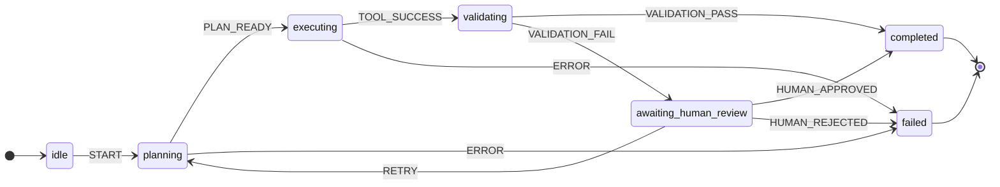
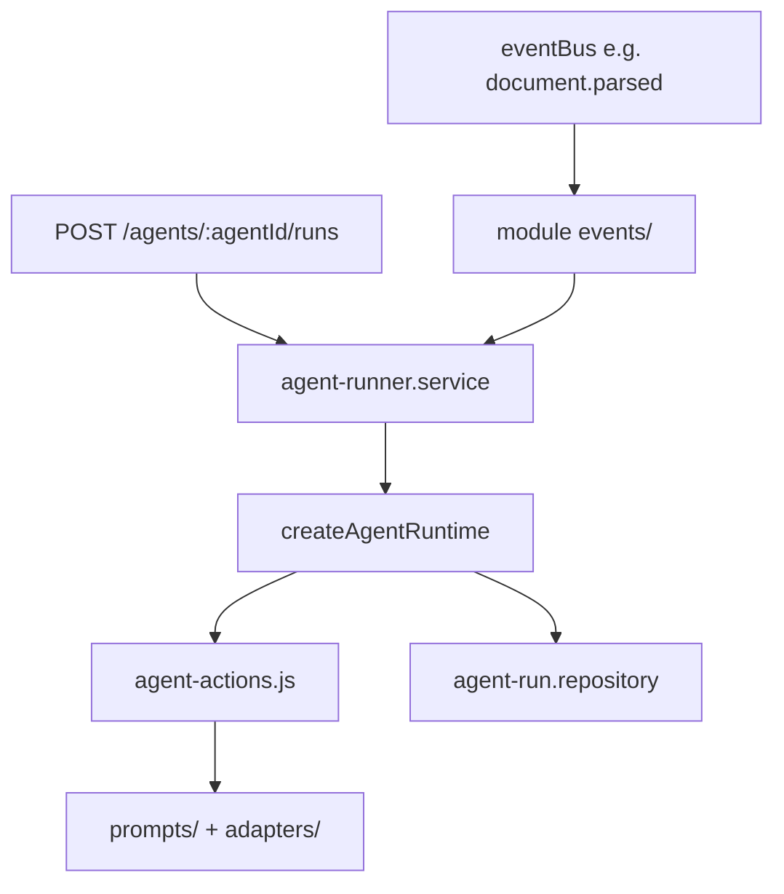

# Contract: module agent state machine

**Version:** `v001`  
**Code:** `backend/src/shared/contracts/moduleAgentStateMachine.contract.js`  
**Runtime:** `backend/src/shared/agent-runtime/createAgentRuntime.js`  
**Implementation guide:** [templates/module-agent-state-machine/README.md](../templates/module-agent-state-machine/README.md)

## Purpose

Each feature module owns one or more **AI agents**. Every agent is controlled by an explicit **finite state machine (FSM)** — not ad-hoc `if/else` orchestration in routes or services.

| Concern | State machine controller | Ad-hoc service logic |
|---------|--------------------------|----------------------|
| Flow visibility | States and transitions are declared in `agents/*.machine.js` | Hidden in nested conditionals |
| Resumability | Persisted `agent_runs` + event log | Lost on crash |
| Cross-module triggers | `eventBus` → module `events/` → `services/` → FSM | Tight coupling |
| Testing | Transition table + action mocks | Full integration only |
| Multiple agents per module | One machine file per agent + `agents/manifest.json` | One god-service |

This contract is the **main controller** for module agents. Services **delegate** lifecycle to the shared runtime; they implement **actions** (side effects) but do not own transition logic.

## Per-module layout

```text
backend/src/modules/<module-name>/
├── agents/
│   ├── manifest.json              ← registry of agent ids + machine files
│   └── <agent-id>.machine.js      ← FSM definition (pure, no I/O)
├── services/
│   ├── agent-runner.service.js    ← wires runtime + persistence + actions
│   └── agent-actions.js           ← action implementations (LLM, tools)
├── repositories/
│   └── agent-run.repository.js    ← agent_runs + agent_run_events tables
├── events/
│   └── index.js                   ← eventBus → start/send on FSM (via services)
└── routes/
    └── agent.routes.js            ← HTTP: start run, send event, get snapshot
```

Copy templates from [templates/module-agent-state-machine/](../templates/module-agent-state-machine/README.md).

## Machine definition shape

Each `agents/<agent-id>.machine.js` exports:

```js
export const exampleAgentMachine = {
  id: "example-assistant",
  version: "v001",
  module: "<module-name>",
  initial: "idle",
  contextKeys: ["documentId", "matterId"],
  states: {
    idle: { on: { START: "planning" } },
    planning: { on: { PLAN_READY: "executing", ERROR: "failed" }, action: "plan" },
    executing: { on: { TOOL_SUCCESS: "validating", ERROR: "failed" }, action: "execute" },
    validating: { on: { VALIDATION_PASS: "completed", VALIDATION_FAIL: "awaiting_human_review" } },
    awaiting_human_review: {
      on: { HUMAN_APPROVED: "completed", HUMAN_REJECTED: "failed", RETRY: "planning" }
    },
    completed: { type: "final" },
    failed: { type: "final" },
    cancelled: { type: "final" }
  }
};
```

| Field | Required | Meaning |
|-------|----------|---------|
| `id` | yes | Stable agent id within module |
| `version` | yes | Bump when transitions change |
| `module` | yes | Owning module folder name |
| `initial` | yes | State at run start |
| `contextKeys` | no | Documented context fields (audit) |
| `states` | yes | Map of state name → `{ on, action?, type? }` |
| `states.*.on` | no | `{ EVENT_NAME: "nextState" }` |
| `states.*.action` | no | Action name resolved in `agent-actions.js` on **entry** |
| `states.*.type: "final"` | no | Terminal state |

## Standard events (recommended)

Modules may add domain-specific events. Prefer these names for consistency:

| Event | Typical use |
|-------|-------------|
| `START` | Begin run from `idle` |
| `INPUT_RECEIVED` | External payload arrived |
| `PLAN_READY` | Planning action succeeded |
| `TOOL_SUCCESS` / `TOOL_FAILED` | Tool/adapter call result |
| `VALIDATION_PASS` / `VALIDATION_FAIL` | Output checks |
| `HUMAN_APPROVED` / `HUMAN_REJECTED` | Human-in-the-loop gate |
| `ERROR` | Unrecoverable step failure |
| `RETRY` | Re-enter earlier state |
| `CANCEL` | Abort to `cancelled` |

## Runtime flow





## Persistence

When `DATABASE_URL` is configured, persist runs via [migration template](../templates/module-agent-state-machine/migrations/001_agent_state_machine.sql):

| Table | Purpose |
|-------|---------|
| `agent_runs` | Current state, context JSON, status |
| `agent_run_events` | Append-only transition audit log |

In-memory persistence is acceptable for local spikes; production modules should use the repository template.

## Async operations (BullMQ)

FSM **state** lives in SQL (`agent_runs`). Long-running **actions** (LLM, tools) must run in a BullMQ worker per [asyncJobQueue](./asyncJobQueue.contract.md):

1. `agent-actions.js` enqueues `agents.run-action` with `{ runId, eventType, payload }`.
2. Worker executes the action → calls `agentRunner.send()` on success/failure.
3. SQL + event log update before emitting `agent.run.*` on the bus.

Do not block HTTP on LLM calls. Do not store run state only in Redis.

## Event bus (in-process)

Emit from `agent-runner.service` after successful persistence:

| Event | Payload (minimum) |
|-------|-------------------|
| `agent.run.started` | `{ runId, agentId, module, state }` |
| `agent.run.transitioned` | `{ runId, agentId, from, to, eventType }` |
| `agent.run.completed` | `{ runId, agentId, context }` |
| `agent.run.failed` | `{ runId, agentId, error }` |

Other modules **subscribe** in their own `events/index.js`; they must not import peer modules.

## HTTP surface (implement in owning module)

| Method | Path | Purpose |
|--------|------|---------|
| POST | `/agents/:agentId/runs` | Start run (`START` + initial context) |
| POST | `/agents/runs/:runId/events` | Send event `{ type, payload }` |
| GET | `/agents/runs/:runId` | Snapshot (state, context, history) |
| POST | `/agents/runs/:runId/cancel` | Send `CANCEL` |

Register in `docs/API.md`.

## Layer rules

| Layer | Role |
|-------|------|
| **agents/** | Pure machine definitions only — no DB, HTTP, LLM |
| **services/agent-actions** | Side effects: call prompts, adapters, repositories |
| **services/agent-runner** | Sole owner of FSM lifecycle (start, send, cancel) |
| **events/** | Translate `eventBus` into runner calls — no FSM logic here |
| **routes/** | HTTP → runner only |

See [MODULE_INTERNAL_CONTRACT.md](../MODULE_INTERNAL_CONTRACT.md) (`agents` layer).

## Integration with document persistence

When [documentPersistence](./documentPersistence.contract.md) is implemented, a typical cross-module flow:

1. Upload module emits `document.parsed`.
2. Your module `events/index.js` listens and calls `agentRunner.start("intake-agent", { documentId })`.
3. FSM drives planning → execution → validation without importing the documents module.

## Implementation checklist

1. Copy templates from `docs/architecture/templates/module-agent-state-machine/`.
2. Add `agents/` to your module (or `npm run new:module` then copy templates).
3. Define machines in `agents/*.machine.js`; register in `agents/manifest.json`.
4. Implement `agent-actions.js` and `agent-run.repository.js`.
5. Wire `createAgentRuntime` in `agent-runner.service.js`.
6. Subscribe to cross-module events in `events/index.js`.
7. Expose HTTP routes; document in `docs/API.md`.
8. Run `npm run lint:architecture` and `npm run test:ci`.

## Related contracts

- [asyncJobQueue.contract.md](./asyncJobQueue.contract.md) — BullMQ workers for agent actions
- [documentPersistence.contract.md](./documentPersistence.contract.md) — upload/parse triggers
- [MODULE_INTERNAL_CONTRACT.md](../MODULE_INTERNAL_CONTRACT.md) — module layers
- [ARCHITECTURE_GUARDRAILS.md](../ARCHITECTURE_GUARDRAILS.md) — no cross-module imports
